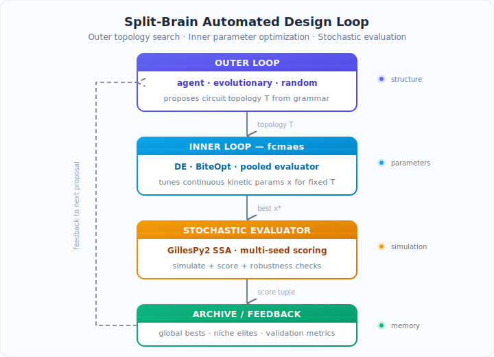
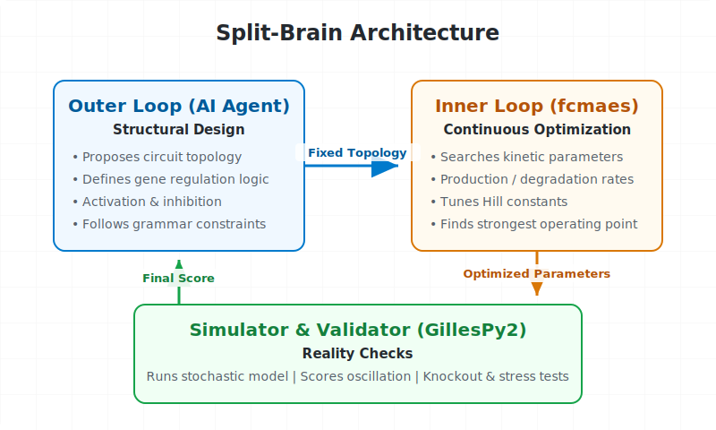
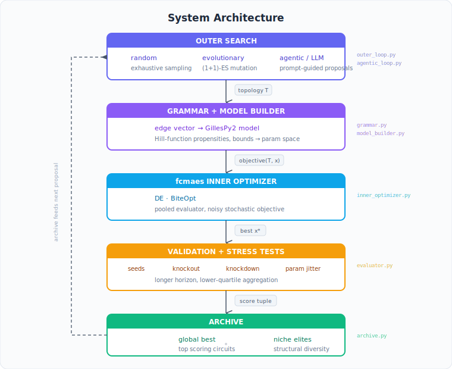
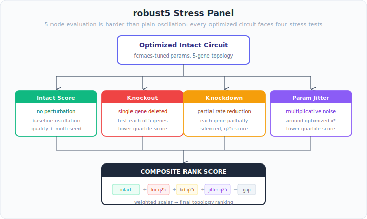
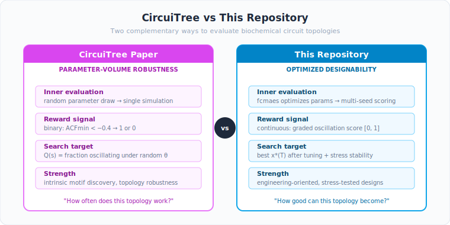
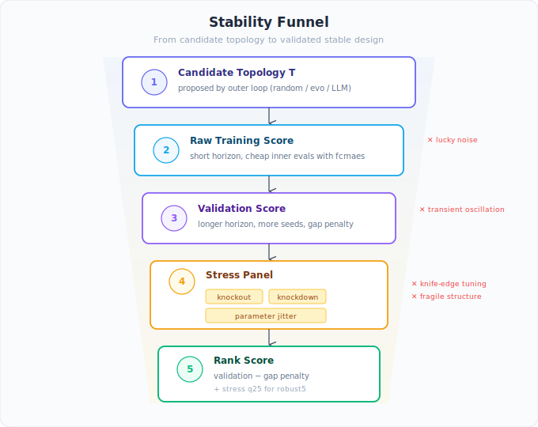
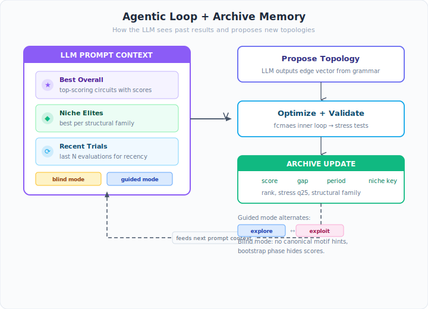
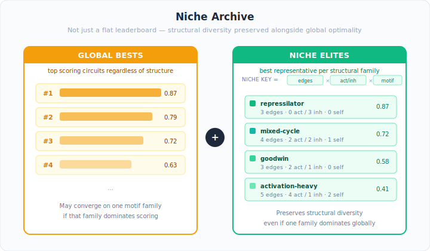
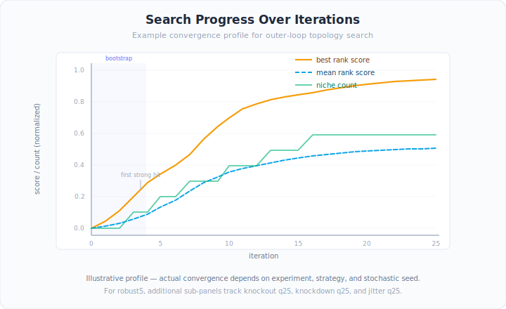

# Circuit Search — Split-Brain Automated Design of Stochastic Biochemical Circuits

A split-brain automated design loop for stochastic biochemical circuits,
showcasing `fcmaes` as the inner optimization engine.

This project is closely related to the CircuiTree paper
["Designing biochemical circuits with tree search"](https://doi.org/10.1101/2025.01.27.635147)
by Pranav S. Bhamidipati and Matthew Thomson.



## The Core Idea: Splitting the Brain

If you ask a language model to design a biochemical circuit end to end, it usually mixes up two very different problems. It may come up with an interesting topology, but then guess poor kinetic parameters and conclude that the whole idea failed.

That is the same failure mode addressed in the trading sister project
[`autoresearch-trading`](https://github.com/dietmarwo/autoresearch-trading): the model is good at proposing structure, but weak at guessing continuous numbers. In trading those numbers are thresholds and weights. Here they are production rates, degradation rates, Hill constants, cooperativity terms, and other kinetic parameters.



This repository fixes that by splitting the job in half so each component does what it is best at:

1. The outer loop handles structural design. It proposes a circuit topology: which genes regulate which other genes, with activation or inhibition, under the grammar constraints of the benchmark.
2. The inner loop handles continuous optimization. For every fixed topology, `fcmaes` searches the kinetic parameter space and finds the strongest operating point it can.
3. The simulator and validator handle reality checks. GillesPy2 runs the stochastic model, the evaluator scores oscillation quality, and the final validation pass applies stricter seed, knockout, knockdown, and parameter-jitter tests.

This separation matters because it gives the outer loop a much cleaner learning signal. A bad final score is much less likely to mean "the topology was good but the guessed rates were bad." Instead, the structural search gets feedback that is closer to the real engineering question: can this topology, once tuned properly, become a strong and stable stochastic oscillator?

The result is the biochemical-circuit analogue of `autoresearch-trading`: the outer loop proposes structure, `fcmaes` tunes the numbers, the simulator scores the design, and the loop repeats.

## Where else does this work?

The split-brain pattern is broader than either trading or biochemical circuits. It works whenever there is a clean boundary between discrete design choices and continuous parameter tuning, and whenever a simulator can tell us how good the result is.

This repository is the biochemical-circuit sister example, while
[`autoresearch-trading`](https://github.com/dietmarwo/autoresearch-trading) is the trading one. In both cases, the architecture is the same:

- propose structure with an outer search
- optimize continuous parameters with `fcmaes`
- validate in a domain simulator

That same pattern also fits several neighboring scientific and engineering problems:

- Synthetic biology beyond oscillators: propose feedback topologies, sensor wiring, or resource-sharing motifs; then tune kinetic constants to maximize switching sharpness, adaptation, or robustness.
- Metabolic engineering: propose pathway additions, enzyme-control structure, or regulation logic; then optimize expression levels, catalytic rates, and transport parameters against a flux or yield simulator.
- Bioprocess control: propose staged feeding or induction policies; then optimize continuous timing, dosage, and controller gains in a fermentation model.
- Robotics and control: propose a controller structure or behavior tree; then tune gains, timing constants, and trajectory parameters in a physics simulator.
- Trading, as in the sister project: propose the strategy logic; then optimize thresholds, weights, and risk parameters against a market backtest.

Any time the hard part is partly combinatorial and partly continuous, this architecture is a strong fit. The outer loop explores what to build. The inner optimizer figures out how far that design can be pushed.

The project supports two experiment presets:

- `oscillator3`: the original 3-gene traveling-wave oscillator benchmark
- `robust5`: a 5-gene oscillator benchmark that rewards single-gene knockout robustness
  plus partial knockdown and local parameter-jitter robustness

## Architecture



## Quick Start

```bash
pip install fcmaes gillespy2 numpy scipy matplotlib

# Random search (baseline) — 30 topologies
python run_search.py --experiment oscillator3 --strategy random --n 30

# Evolutionary (1+1)-ES — 50 iterations
python run_search.py --experiment oscillator3 --strategy evo --n 50

# LLM-guided agentic search (requires ANTHROPIC_API_KEY)
python run_search.py --experiment oscillator3 --strategy agentic --n 20

# Blind benchmark mode: no canonical motif hints, bootstrap before exploitation
python run_search.py --experiment oscillator3 --strategy agentic --agentic-mode blind --n 20

# Guided mode: bootstrap, then alternate exploration/exploitation
python run_search.py --experiment oscillator3 --strategy agentic --agentic-mode guided --n 20

# Guided MiniMax run
python run_search.py --experiment oscillator3 --strategy agentic --agentic-mode guided --model MiniMax-M2.7 --llm-backend minimax

# 5-gene robust oscillator benchmark
python run_search.py --experiment robust5 --strategy agentic --agentic-mode blind --model MiniMax-M2.7 --llm-backend minimax --n 12

# Quick test (small budget, fast)
python run_search.py --experiment oscillator3 --strategy random --n 5 --inner-evals 200 --workers 2
```

## Experiments

`oscillator3`

- 3 genes, 9 edge slots
- objective: coherent traveling-wave oscillator
- best for reproducing known minimal motifs like repressilators and Goodwin-like loops

`robust5`

- 5 genes, 25 edge slots, 5 to 15 active interactions
- objective: weighted scalar score combining
  - intact-network oscillation quality
  - lower-quartile single-gene knockout score across all knockout scenarios
  - fraction of knockouts that remain strongly oscillatory
  - lower-quartile single-gene partial-knockdown score
  - lower-quartile score under local parameter jitter around the fcmaes optimum
- uses a longer validation pass than `oscillator3` to separate near-ties more aggressively
- best for testing whether higher-complexity robust designs move beyond the standard 3-gene prior



The inner loop remains unchanged conceptually in both presets: `fcmaes` still solves a single scalar optimization problem for each fixed topology. For `robust5`, the training objective stays cheaper than the validation objective; the more expensive knockdown and parameter-jitter checks are used mainly to rank optimized topologies, not to blow up every inner-loop function call.

## Relation To CircuiTree

This repository is inspired by the CircuiTree paper, but it asks a different question.

CircuiTree asks:

- Which topologies are robust under random parameter draws?

This repository asks:

- Which topologies can be tuned well with `fcmaes`, and which of those tuned designs remain stable under stress?

That distinction matters. CircuiTree is primarily about topology discovery and motif inference. This repository is primarily an application example for `fcmaes`, so the inner loop is the main character and the outer loop is the structural search wrapper around it.



### How CircuiTree Evaluates A Topology

CircuiTree does **not** run an inner continuous optimizer like DE, CMA-ES, or BiteOpt for each topology.

Instead, the paper evaluates oscillation with a binary autocorrelation-based reward:

- simulate one stochastic trajectory with randomly sampled parameters and initial conditions
- compute the normalized autocorrelation function (ACF)
- find the lowest interior minimum `ACFmin`
- assign reward `1` if `ACFmin < -0.4`, else `0`

For the 3-node benchmark, the paper first enumerates the full design space and estimates
`Q(s)`, the fraction of random parameter draws that oscillate for topology `s`. During the MCTS benchmark itself, each reward is then drawn as a Bernoulli sample with success probability `Q(s)` rather than by running a fresh inner optimizer.

For the 5-node search, exact enumeration is no longer feasible, so parallel MCTS samples fresh random parameter sets during search and still uses the same yes/no oscillation reward. Fault tolerance is then assessed by repeating this procedure under random deletions, and the paper later studies partial knockdown and parameter heterogeneity on selected top circuits.

In other words, the paper's effective inner evaluation loop is:

1. Sample a parameter vector from a biologically motivated range.
2. Sample random initial conditions.
3. Run one stochastic simulation.
4. Compute `ACFmin` from the normalized autocorrelation function.
5. Return a binary reward from the threshold test.
6. Repeat across many random parameter draws to estimate robustness `Q(s)`.

That makes the search target:

- "how often does this topology work under random parameterization?"

rather than:

- "how good can this topology become after tuning?"

### Why The Paper Uses That Inner Evaluation

That choice is deliberate.

- It measures **parameter-volume robustness**, not best-case tunability.
- It keeps the MCTS reward aligned with the paper's scientific question: which topologies work often under random parameterization?
- For the 3-node case, it gives a clean ground truth for recall, precision, and motif-discovery comparisons against enumeration.
- It avoids conflating topology quality with the behavior of a separate inner optimizer.

This is why CircuiTree is well suited to statements such as "motif X is overrepresented among robust topologies" or "5-node fault tolerance emerges from motif multiplexing."

### What This Repository Does Instead

This project keeps the outer structural search idea, but changes the inner evaluation so that each topology gets a serious continuous optimization pass with `fcmaes`.

For a fixed topology, we optimize a **continuous** scalar objective rather than a binary oscillates/does-not-oscillate reward. The base trace score combines:

- detrending to reject monotonic growth/decay
- prominence-based peak detection
- trough-depth and amplitude checks
- peak-spacing and amplitude regularity
- persistence over time
- an autocorrelation-based periodicity term
- multi-gene coherence and, for `oscillator3`, phase separation

This continuous score is essential because `fcmaes` needs a graded signal. A binary reward would create huge flat regions and make the inner optimization much less informative.

The effective inner loop here is:

1. Fix a topology.
2. Let `fcmaes` optimize the continuous kinetic parameters for that topology.
3. For each candidate parameter vector, run stochastic simulations and compute a continuous raw score.
4. Keep the best parameter vector found by the optimizer.
5. Re-evaluate that optimized design with stricter validation and stress tests.

So our question is not "is this topology robust under random parameters?" but rather:

- "can this topology be engineered into a strong oscillator, and is that engineered design still stable under perturbation?"

### How We Push Toward Stable Structures

To avoid selecting topologies that only look good at one lucky operating point, the final ranking is stricter than the raw training objective.

We do that in several ways:

- optimize a raw continuous score during the inner search
- validate on longer simulations and more stochastic seeds
- penalize the train/validation gap
- in `robust5`, score the optimized topology under:
  - intact conditions
  - single-gene knockout scenarios
  - partial single-gene knockdown scenarios
  - local multiplicative parameter jitter around the optimized point
- aggregate stress scenarios with a lower quantile instead of only the mean or median

So "stable" here does not mean "works for a random draw of parameters" in the CircuiTree sense. It means:

- there exists a tuned operating point found by `fcmaes`
- that point generalizes across stochastic seeds and a longer horizon
- and it survives structured perturbations instead of collapsing immediately

More concretely, this repository tries to reject four common failure modes:

- **lucky noise**: a single stochastic run happens to look oscillatory
- **transient oscillation**: the signal oscillates briefly and then damps out
- **knife-edge tuning**: one optimized point looks good but tiny parameter changes destroy it
- **fragile structure**: oscillation disappears after single-gene knockout or knockdown

The current evaluator addresses these with:

- multi-seed scoring instead of a single run
- longer validation horizons than training horizons
- a train/validation gap penalty
- lower-quantile aggregation across stress scenarios
- local parameter jitter around the optimized point
- for `robust5`, explicit knockout and partial-knockdown panels
- an autocorrelation-based periodicity term in addition to peak/trough checks



This is why the score should be read as a stability-aware **optimized-design score**, not as a pure random-parameter robustness probability.

### Why This Approach Works

This is not a reproduction of the CircuiTree robustness definition. It is a different, more engineering-oriented experiment, and that is intentional.

The motivation is:

- synthetic-circuit design in practice usually includes parameter tuning
- `fcmaes` should be judged on whether it can find good operating points for hard stochastic models
- a topology should not win only because one random simulation happened to oscillate
- a tuned design is more convincing if it remains good under seed variation, knockouts, knockdowns, and local parameter perturbations

This makes the project scientifically meaningful in a different way:

- CircuiTree is strong for discovering intrinsic topology motifs under random parameterization.
- This repository is strong for studying **designability**: how much a topology can be improved by optimization, and how robust that tuned design is in a neighborhood of the optimum.

That distinction is especially relevant once the search space becomes larger. In higher-dimensional topologies, the interesting question is often not only which motifs are intrinsically robust, but also whether a broad class of structures becomes similarly tunable once a powerful inner optimizer is available. That is exactly the kind of question this codebase is built to explore.

In that sense, this repository studies **designability** rather than pure parameter-volume robustness. CircuiTree asks which motifs are intrinsically robust under random parameterization. This repository asks how far a powerful inner optimizer can push a topology, and whether the resulting design is still stable in a neighborhood of the optimum.

## Preliminary Findings

The results in this repository should currently be read as **preliminary**. They are already informative, but they are not yet a final benchmark study with many repeated runs per method.

### What We See So Far

For `oscillator3`, the search remains strongly topology-sensitive.

- Known small motifs such as repressilator- and Goodwin-like structures are repeatedly recovered.
- If we explicitly seed the agent with those motifs, the outer loop can solve the task almost immediately.
- Blind agentic mode is therefore the more meaningful benchmark setting for `oscillator3`.

For `robust5`, the picture is different.

- Under the current optimized-design objective, many 5-gene topologies can be tuned by `fcmaes` into similarly strong solutions.
- After tightening the validation and stress tests, the score distribution widened enough to reveal structure, but the top of the landscape is still comparatively flat.
- In direct comparisons, blind agentic search and random search often reach extremely similar top scores.
- Random search currently tends to cover more niches, while blind agentic search tends to focus faster on one strong family.

That means the current `robust5` results are consistent with a hypothesis that is quite interesting:

- the 5-gene task, under strong continuous optimization, may be more **inner-loop dominated**
- while the minimal 3-gene task is more **outer-loop / topology dominated**

### Comparison With CircuiTree / MCTS

This does **not** mean the CircuiTree `N=5` results were wrong. It means the two projects answer different questions.

CircuiTree `N=5`:

- no inner continuous optimizer
- random parameter draws
- binary autocorrelation reward
- measures intrinsic robustness of topology under random parameterization and deletion

This repository `robust5`:

- strong inner continuous optimization with `fcmaes`
- continuous training objective
- validation with seeds, knockout, knockdown, and local parameter jitter
- measures optimized designability and local robustness around an engineered operating point

So the current comparison suggests a potentially important distinction:

- a topology can be highly informative under **random-parameter robustness**
- yet many more topologies may become competitive under **optimized designability**

If that distinction continues to hold in larger replicated studies, then the right conclusion is not that MCTS-based topology search was unnecessary, but that:

- intrinsic robustness and optimized tunability are different properties

### What This Means For Agents And `fcmaes`

The outer agent and the inner optimizer are useful in different regimes.

Agents tend to shine when:

- the search space is strongly topology-dominated
- biological or structural priors are informative
- partial progress can be summarized and reused
- diversity management and niche exploration matter
- evaluation is so expensive that proposing better topologies is worth more than polishing many mediocre ones

This is closest to:

- small or medium circuit topologies
- motif discovery problems
- constructive search problems closer to CircuiTree's assembly-tree formulation

`fcmaes` tends to shine when:

- each fixed topology still has a large, expressive continuous parameter space
- the objective provides an informative graded ranking signal, even if it is noisy, rugged, and non-differentiable
- many topologies are potentially salvageable by good tuning
- local robustness around an optimum matters more than random-parameter success rate

This is closest to:

- higher-dimensional circuit families
- engineering-oriented design tasks
- situations where "can this topology be tuned into a good design?" matters more than "does it work often without tuning?"

### Working Interpretation

The current working interpretation is:

- `oscillator3`: outer-loop reasoning still matters a lot
- `robust5`: inner-loop optimization may dominate more than expected

If this continues to hold, then the practical lesson is:

- use agents to generate structure when the search is genuinely combinatorial and motif-sensitive
- use `fcmaes` aggressively when the main difficulty is finding a strong operating point inside a rich continuous parameter space

In other words:

- agents are best for **where to search**
- `fcmaes` is best for **how far a candidate can be pushed once chosen**

That split-brain division remains the central hypothesis of this project.

## Agentic Modes

The agentic loop now supports two distinct operating modes:



- `blind`: benchmark-oriented mode. Removes canonical motif hints from the system prompt, hides score-based anchoring during the bootstrap phase, and is the better choice when you want to test whether the outer loop can discover strong topologies without being led to the repressilator family.
- `guided`: application-oriented mode. Keeps biological priors available, uses a short no-score bootstrap phase, then alternates between `explore` and `exploit` turns. Exploration turns enforce a minimum Hamming distance from the current niche-elite archive family to keep the search from orbiting one basin too tightly.

Useful options:

- `--agentic-mode blind|guided`: choose the prompting/search policy
- `--bootstrap-iters N`: number of initial diverse proposals before showing the current best
- `--explore-min-hamming K`: novelty threshold enforced during bootstrap and exploration turns

Examples:

```bash
# Blind benchmark: closest to an MCTS-style "start from scratch" initialization,
# while still proposing complete topologies instead of partial assemblies
python run_search.py --experiment oscillator3 --strategy agentic --agentic-mode blind --bootstrap-iters 6 --n 30

# Guided search with stronger novelty pressure
python run_search.py --experiment oscillator3 --strategy agentic --agentic-mode guided --bootstrap-iters 4 --explore-min-hamming 4 --n 30

# 5-gene robust search: no motif hints, larger exploration radius
python run_search.py --experiment robust5 --strategy agentic --agentic-mode blind --bootstrap-iters 6 --explore-min-hamming 5 --n 12
```

## Niche Archive

The outer loop now keeps two complementary memories:



- a global leaderboard of the best overall topologies
- a niche archive that preserves the best representative for each structural family

The niche descriptor is intentionally structural and lightweight:

- active edge count
- activation vs inhibition count
- number of self-regulatory edges
- coarse core motif flags such as `repressilator`, `toggle`, `mixed_cycle`, `goodwin`, or `other`

This is deliberately kept in the outer loop only. The inner `fcmaes` optimizer stays single-objective and structure-agnostic: it still only tunes continuous parameters for one fixed topology at a time.

During agentic search, the LLM now sees:

- best overall topologies
- best niche elites
- recent evaluations

That makes the archive more like a lightweight MAP-Elites-style memory for structural diversity, without changing the inner optimizer into a multi-objective or niche-aware search.



## File Structure

| File | Lines | Purpose |
|------|-------|---------|
| `config.py` | 81 | All hyperparameters in one place |
| `grammar.py` | 160 | 3-gene topology grammar, encoding, mutation, canonical motifs |
| `model_builder.py` | 184 | Topology + params → GillesPy2 model with Hill-function propensities |
| `evaluator.py` | 228 | Oscillation quality scoring: detrending, peak/trough analysis, multi-seed |
| `inner_optimizer.py` | 119 | fcmaes wrapper: DE with pooled evaluator, Bite_cpp fallback |
| `outer_loop.py` | 163 | Random search + evolutionary (1+1)-ES strategies |
| `agentic_loop.py` | 266 | LLM-guided topology proposal with structured feedback |
| `archive.py` | 121 | Results storage, ranking, JSON/pickle serialisation |
| `viz.py` | 237 | Trace plots, network diagrams, score progression charts |
| `run_search.py` | 146 | CLI entry point |

## Topology Grammar

- Experiment-dependent gene set:
  - `oscillator3`: 3 genes, 9 edge slots
  - `robust5`: 5 genes, 25 edge slots
- Each edge: absent (0) / activation (1) / inhibition (2)
- Constraints:
  - `oscillator3`: 2–6 active edges, no isolated nodes
  - `robust5`: 5–15 active edges, no isolated nodes
- The 3-gene experiment can be enumerated exactly; the 5-gene experiment is sampled directly because the raw space is too large for flat enumeration.

## Evaluator Design

The oscillation scorer avoids common false positives:

1. **Linear detrending** — rejects monotonic growth/decay
2. **Prominence-based peak detection** — rejects stochastic noise bumps
3. **Trough depth validation** — requires real valleys between peaks
4. **Amplitude-to-mean ratio** — rejects weak fluctuations on high baselines
5. **Autocorrelation periodicity** — rewards repeated self-similarity at one and two inferred periods
6. **Multi-seed median** — resists stochastic outliers

For the 5-gene robust experiment, the scalar objective also includes:

1. **Intact-network oscillation score**
2. **Single-gene knockout score** — lower quartile across knockout scenarios, so one weak deletion hurts
3. **Knockout survival rate** — fraction of knockouts still above a stricter robustness threshold
4. **Single-gene knockdown score** — lower quartile across partial knockdown scenarios
5. **Local parameter robustness** — lower quartile across multiplicative parameter jitters around the optimized point

## Known Canonical Motifs

| Motif | Edges | Expected |
|-------|-------|----------|
| Repressilator | A⊣B, B⊣C, C⊣A | Strong oscillator |
| Goodwin loop | A→B, B→C, C⊣A | Delayed negative feedback |
| Toggle switch | A⊣B, B⊣A | Bistable (not oscillatory) |

## Dependencies

- `fcmaes` — fast gradient-free optimization (C++/Eigen backend)
- `gillespy2` — stochastic simulation (SSA)
- `numpy`, `scipy` — numerics, peak detection
- `matplotlib` — plotting
- `anthropic` — (optional) for agentic loop

## Context

This project extends `fast-cma-es/examples/vilar.py` from parameter optimization
of one fixed stochastic reaction network to **outer-loop structural search** over
a bounded space of reaction-network topologies. It mirrors the split-brain
architecture of `autoresearch-trading`: the outer loop proposes structure,
`fcmaes` optimizes numbers.
